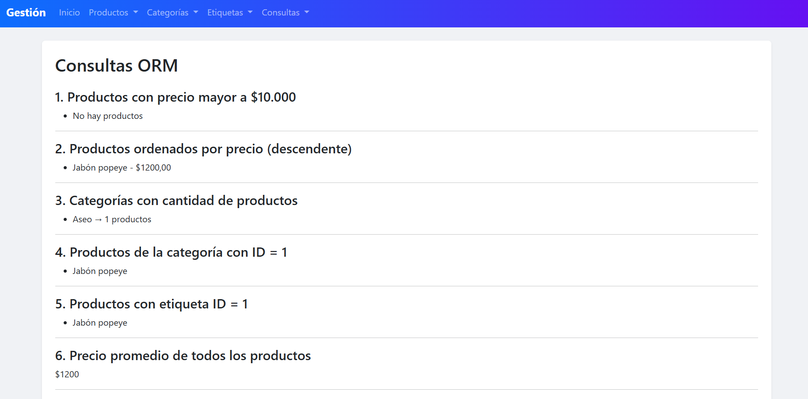
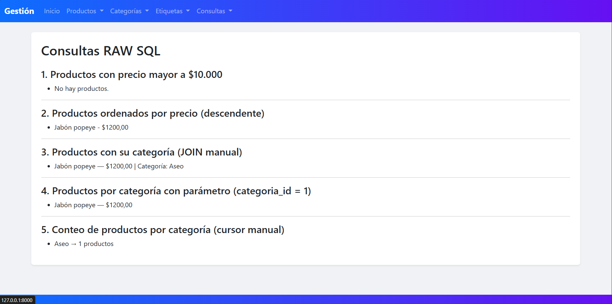
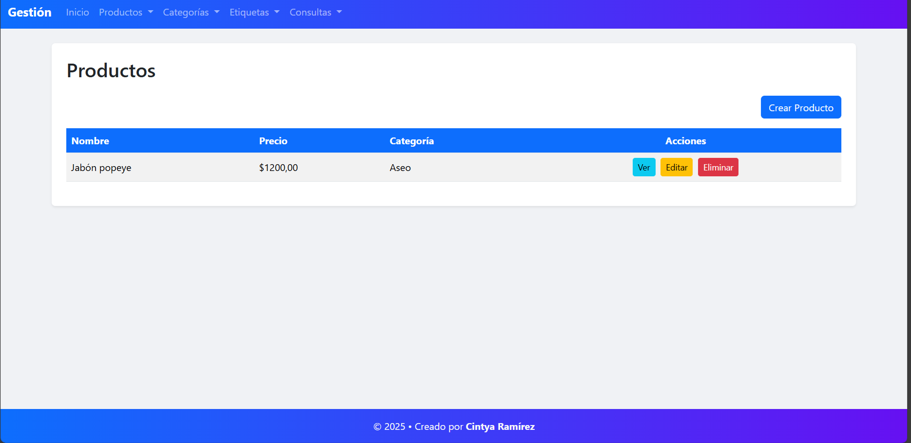
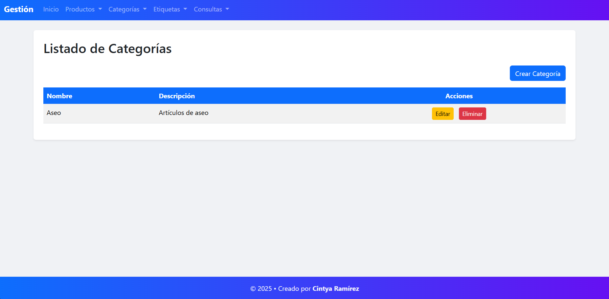
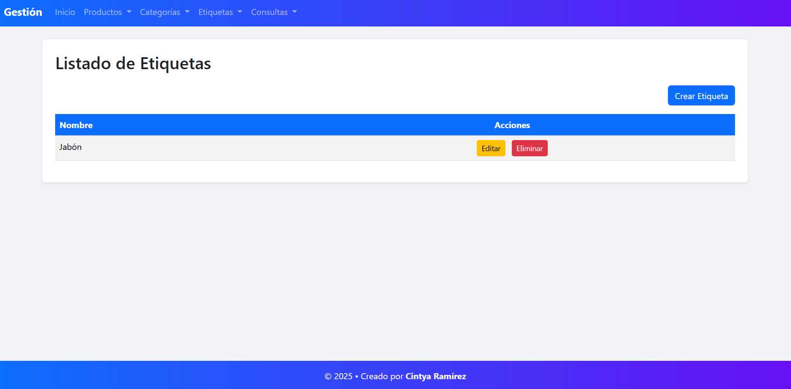
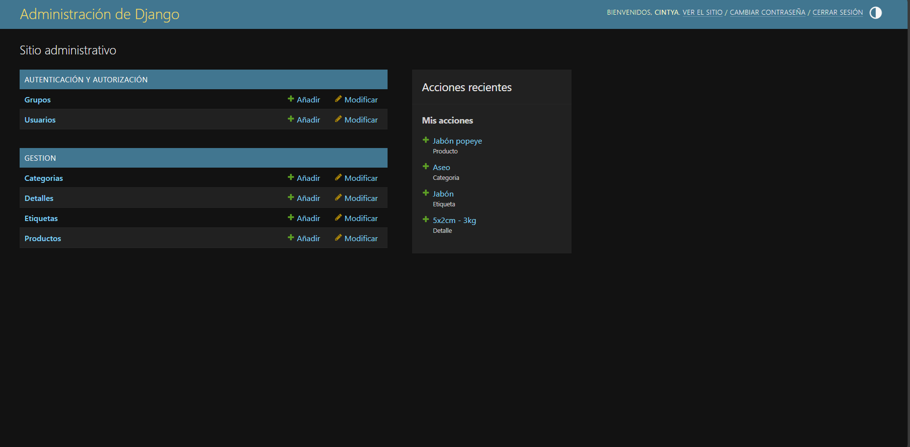

# 📦 Proyecto: Sistema de Gestión de Productos (Django)

Este proyecto corresponde a una evaluación del Módulo 7 del curso Talento Digital.  
Implementa un sistema completo para gestionar **productos**, **categorías**, **etiquetas** y **detalles**, incluyendo operaciones CRUD, consultas ORM avanzadas y consultas SQL RAW.

---

## 🚀 Tecnologías utilizadas

- Python 3.12  
- Django 5.2.8  
- Bootstrap 5  
- Bootstrap Icons  
- SQLite  
- HTML + CSS  

---

## 📁 Estructura del proyecto

```plaintext
gestion_productos/
│── gestion_productos/
│   ├── settings.py
│   ├── urls.py
│   └── ...
│
│── gestion/
│   ├── models.py
│   ├── forms.py
│   ├── views.py
│   ├── admin.py
│   ├── urls.py
│   └── templates/
│       ├── base.html
│       ├── productos/
│       ├── categorias/
│       ├── etiquetas/
│       └── consultas/
│
│── static/
│   └── css/style.css
│
├── img/   ← Capturas de pantalla
└── README.md
```

---

# ⚙️ Instalación y ejecución

## 1️⃣ Clonar el proyecto  
```bash
git clone <URL_DEL_REPOSITORIO>
```

## 2️⃣ Crear y activar entorno virtual  

### Windows:
```bash
python -m venv venv
venv\Scripts\activate
```

### Linux/Mac:
```bash
python3 -m venv venv
source venv/bin/activate
```

## 3️⃣ Instalar dependencias  
```bash
pip install -r requirements.txt
```

## 4️⃣ Aplicar migraciones  
```bash
python manage.py makemigrations
python manage.py migrate
```

## 5️⃣ Crear superusuario  
```bash
python manage.py createsuperuser
```

## 6️⃣ Ejecutar servidor  
```bash
python manage.py runserver
```

---

# 🧩 Modelos

El sistema incluye los siguientes modelos:

### **Producto**
- nombre  
- descripcion  
- precio  
- categoria (FK)
- etiquetas (ManyToMany)
- detalle (OneToOne)

### **Categoría**
- nombre  
- descripcion  

### **Etiqueta**
- nombre  

### **Detalle**
- dimensiones  
- peso  

Relaciones implementadas:

- **Muchos a Uno:** Producto → Categoría  
- **Muchos a Muchos:** Producto ↔ Etiqueta  
- **Uno a Uno:** Producto ↔ Detalle  

---

# 🛠️ CRUD implementados

El sistema cuenta con CRUD completo para:

✔ Productos  
✔ Categorías  
✔ Etiquetas  

Cada CRUD incluye:

- Listar  
- Crear  
- Editar  
- Eliminar con confirmación  
- Detalle (solo productos)

---

# 🔍 Consultas ORM

Incluye consultas avanzadas como:

- `filter()`  
- `exclude()`  
- `order_by()`  
- `annotate()`  
- `aggregate()`  
- productos sin etiquetas  
- productos filtrados por categoría  
- producto más caro y más barato  

📷 **Captura:**  


---

# 🧾 Consultas SQL RAW

Incluye:

- `raw()`  
- `cursor.execute()`  
- JOINS manuales  
- GROUP BY  
- consultas con parámetros  

📷 **Captura:**  


---

# 🖼️ CRUD Productos



# 🖼️ CRUD Categorías



# 🖼️ CRUD Etiquetas



---

# 🔐 Panel de administración

El panel admin está personalizado para:

- filtros  
- búsqueda  
- columnas personalizadas  
- relaciones ManyToMany con `filter_horizontal`  

📷 **Captura:**  


---

# 🎨 Estilos

El sistema utiliza **Bootstrap 5**, incluyendo:

- Navbar con menús desplegables  
- Botones con iconos  
- Tablas estilizadas  
- Formularios responsivos  
- Footer sticky-bottom  

Todo organizado en `static/gestion/style.css`.

---

# 👤 Autor

**Cintya Ramírez**  
Proyecto desarrollado como parte del curso Talento Digital — Módulo 7  
© 2025

---